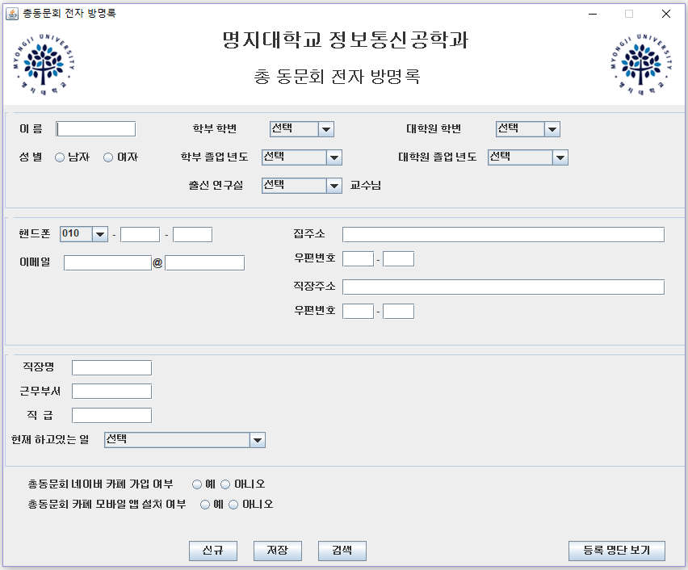
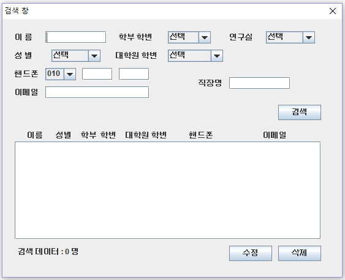

# ToeicHelper

### 프로젝트 개요 :  
대학교 학과 총 동문회에 사용할 전자 방명록 Java 프로그램.

### 기간 : 2013.05 ~ 2013.06

### 주요 기능 :
- GUI를 위한 **Swing** 패키지 사용.
- **mdb 파일(Microsoft Office Access 데이터베이스)** 과 연동하기 위해 **JDBC-ODBC** 패키지 사용.
- **JTextField, JComboBox, JRadioButton** 등을 사용하여 사용자 정보(이름, 이메일, 학번 등) 획득.
- **Query** 문을 활용하여 사용자 등록 정보 검색.
- 등록된 사용자 **리스트 확인** 기능.

#### **사용 기술** : `Java`

#### **사용 툴** : `Eclipse IDE`

### SCREEN SHOT
-------

 
